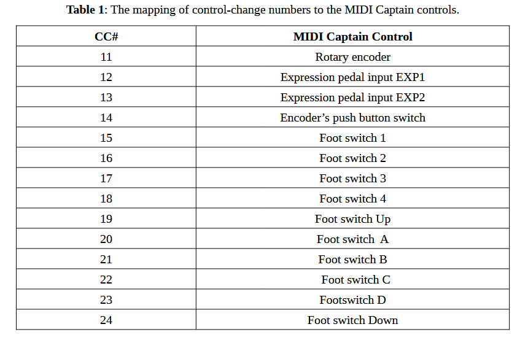
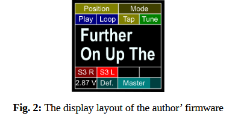
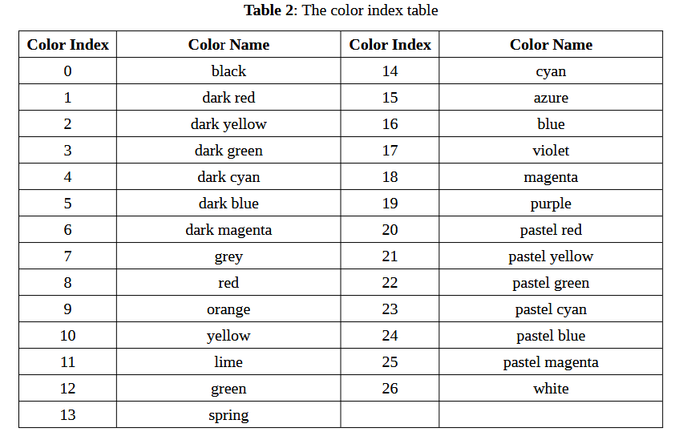
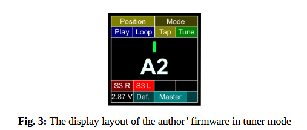
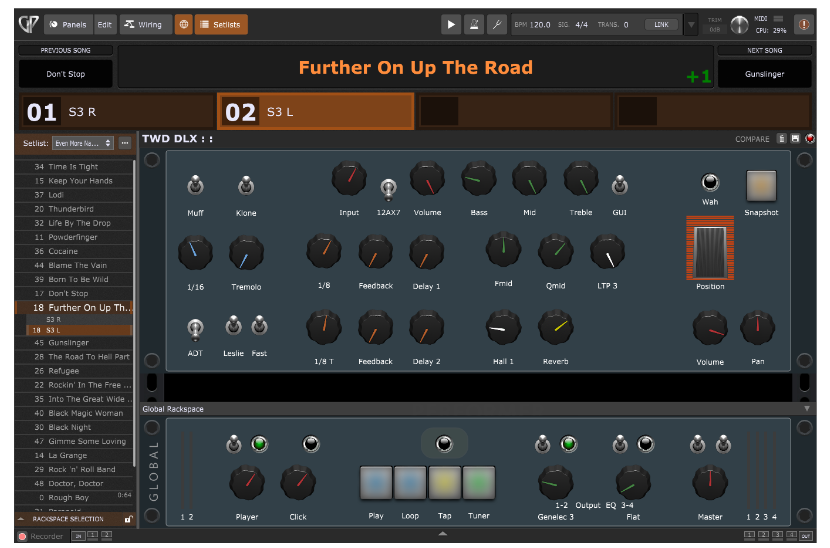

Sections Relevant to Firmware, FROM: https://www.helmutkelleraudio.de/

## 3. Programming the firmware of the MIDI Captain

This chapter can be skipped by those who don’t want to modify the author’s firmware.
Paint Audio provides several versions of firmware for the MIDI Captain. Unfortunately, none of them is useful for our purposes. The only version which allows feedback from the host device works with Kemper products only. The Circuit Python code of the original firmware versions is stored in already compiled files and is thus not readable.

Fortunately, there is a GitHub project [1] where the access to the MIDI Captain’s hardware resources is explained with readable Circuit Python script examples. The GitHub project [2] is an example for bidirectional communication with Kemper products. Another example [3] for Kemper
products exists, but it is very hard to understand. A good introduction to Circuit Python is [4], where an introduction to the Mu Editor is found, as well. The Mu Editor is the preferred tool to edit and debug Circuit Python scripts. The Mu Editor may be downloaded free of charge from [5].

The first step of writing new firmware is to store the original firmware. Foot switch 1 needs to be held down while switching on the MIDI Captain. Its flash drive is now available as “MIDICAPTAIN” on a connected host computer. Copy the complete content of the USB drive and save it at a secure place. Do not forget to eject the USB drive symbol before you disconnect the MIDI Captain from the host computer.

If not already done, you should now install the Mu Editor on your computer.

The next step is to modify the file “boot.py” on the USB drive of the MIDI Captain using the Mu Editor. You need to **change the following two lines:**

```py
import supervisor
supervisor.disable_autoreload()
```
**INTO:**
```
# import supervisor
# supervisor.disable_autoreload()

```

This deactivates the two lines and enables automatic re-booting when a file on MIDI Captain’s USB drive of the has been changed.

Now you should inspect the file “code.py” on the USB drive of the MIDI Captain. You will recognize that this script imports different files with the extension “.mpy”, depending on which foot switch is pressed during switching-on. These files consist of compiled Circuit Python scripts and
contain the different versions of the firmware from Paint Audio. Overwriting the original file “code.py” with the file “code.py” from the author [6] will result in having installed the author’s firmware. It will, however, not run without errors because three files with the extension “.pcf“ are
missing. These are files containing three fonts used by the author but not by Paint Audio. After copying the three font files from [6] to the “fonts” directory of MIDI Captain’s USB drive, the author’s firmware is ready to go and you may modify it. The author’s code is not very complicated
and explained by comments.

## 4. Installing and deinstalling the author’s firmware

Before you install the authors firmware, you should safely store the original firmware: keep the MIDI Captain foot switch 1 pressed while switching on the device. MIDI Captain’s USB drive is now available as “MIDICAPTAIN” on a connected host computer. Copy the complete content of the USB drive and save it to a secure place.

- You can download the author’s firmware package from [6]. It is free of charge.

- Overwrite the original file “code.py” on the USB drive with the file “code.py” from [6]. 

- Copy the following three files “PTSans-Bold-60.pcf”, “PTSans-NarrowBold-54.pcf” and “PTSans-Regular-20.pcf” from [6] into the directory “fonts” on the USB drive: Copy the file “HKAudioSetup.txt” from [6] into the directory “setup” on the USB drive.

- Eject the USB drive before you disconnect the MIDI Captain from the host computer.

- Switch the MIDI Captain off and on again to activate the author’s firmware.

- To deinstall the author’s firmware just overwrite the author’s file “code.py” with the original file.

If some problems should occur simply delete the complete content on the MIDI Captain’s USB drive and write back the complete content you have saved at the very beginning of the installation process.

## 5. User manual for the author’s firmware

All physical controls of the MIDI Captain are mapped to MIDI control change numbers (CC#s). The mapping is shown in Table 1.

This mapping is compatible with the iRig Blue Board for the two expression pedal inputs and the foot switches A to D. Thus, associated functions can be used with both controllers.
The control change commands are sent by MIDI captain whenever a value of a physical control is changed. The switches send a value of 127 when pressed and a value of zero when released.

**Table 1**: The mapping of control-change numbers to the MIDI Captain controls.



The authors firmware reacts to received control-change commands with the same numbers, too. For all controls except the “up” and “down” foot switches, the received value is shown on an associated small rectangle on the display of the device. The LED rings around all ten foot switches are set fully bright for values > 63, and are dimmed for lower values.

The CC#25 has a special meaning: when send by the host with a value > 63, the MIDI Captain is set into a “tuner mode”. The “normal mode” is activated by smaller values.

The display layout of the author’s firmware is shown in Fig. 2. It is organized in 5 rows with rectangles related to the received CC#s. A received song- or preset-name, and the MIDI Captain’s battery voltage are displayed, as well:

1. CC#12 and CC#13
2. CC#15, CC#16, CC#17 and CC#18.
3. A song or preset name, or – when in tuner mode – the note name and a pointer representing the pitch deviation.
4. CC#20, CC#21, CC#22 and CC#23.
5. Battery voltage, CC#14 and CC#11



The received values for each CC# are shown as a brightly lit bars over a darker background. Remember that values of the CC#s mapped to the ten foot switches are shown by the associated LED rings, too. The values of CC#19 and CC#24 are only shown by the associated LEDs because there are no associated rectangles on the display.

The default colors and names of CC#11 to CC#24 are read from the file “HKAudioSetup.txt”. The author’s file has this content:

CC#11: 4, Master
CC#12: 2, Position
CC#13: 2, Mode
CC#14: 4, Def.
CC#15: 16, Play
CC#16: 16, Loop
CC#17: 10, Tap
CC#18: 12, Tune
CC#19: 7, Up
CC#20: 8, SP 1
CC#21: 8, SP 2
CC#22: 8, SP 3
CC#23: 8, SP 4
CC#24: 7, Down

The number after “CC#” is the control-change number of the control. The number after “:” is the color index of the associated LED or rectangle (see Table 2 for the color names of the color indices). The text after the “, ” is the name displayed in the associated rectangles. Do note that there
is a blank after the comma. The name should describe the function of the control. The names for CC#19 and CC#24 are ignored because there are no associated rectangles on the display.



The user can edit this file to define his own default colors and names. During operation the colors and names 
can be set by MIDI system exclusive commands too.
The MIDI Captain reacts on MIDI system exclusive commands in the following format shown as hex-strings:

F0, 59, “CC#”, “Color Index”, “Name String”, F7

The bytes F0 and F7 mark the start and the end of a system exclusive command. The byte 59 is the manufacturer ID expected by the authors firmware.

“CC#” is the hex-string of the control change number. “Color Index” is the hex-string of the color index of the associated LEDs and display rectangles. The “Name String” contains the hex-string values of the ASCII-characters of the name. Null termination is not expected at the end of the string.
The names for CC#19 and CC#24 are ignored because there are no associated rectangles on the display.

The CC#25 has a special meaning again. It sets the name displayed in the big rectangle in the center of the display. This name is probably a song or preset name. The authors firmware breaks the text into two lines if too long for one line. It truncates the text too, if too long at all. Sending strings
longer than 22 characters makes no sense.

---

In tuner mode the big rectangle in the center of the display shows the note name and the pitch deviation as a pointer (see **Fig. 3**).



The MIDI note number is received via note on and note off commands. The MIDI note number is translated by the author’s firmware to the proper note name. Note off means that no pitch deviation can be detected any more. This is shown as the special note name “-----”.

The pitch deviation is received via pitch wheel commands. A value of 8192 corresponds with 200 cents. The pitch deviation is limited by the firmware to + / - 29 cents and then displayed as a pitch deviation pointer.

The free plugin MTuner from Melda Productions sends the tuner data with the expected MIDI commands.

The author’s firmware utilizes the USB and 5 pin connector MIDI interfaces at the same time. It sends all commands to both outputs and listens to commands on both inputs.

## 6. The Bluetooth LE connection to the host computer
A wireless connection between the MIDI Captain and the host computer is necessary because the maximal length of USB cables is too short and two long cables for the 5 pin MIDI input and output
would be very uncomfortable.
The MIDI Captain’s Blue and Gold versions provide a bidirectional wireless MIDI interface. However it is only compatible with a counterpart from Paint Audio which requires 5 pin MIDI connectors for input and output at the host computer side. There is no information available how to access this interface in firmware. Thus the MIDI Captain’s wireless MIDI interface can’t be used by the author’s firmware.

The setup of the author uses a MIDI over Bluetooth LE connection between the MIDI Captain and the host computer. On the MIDI Captain a WIDI Master from CME is plugged into the two 5 pin MIDI connectors. The power is supplied by the MIDI output connector of the MIDI Captain. On the
host computer a WIDI Bud from CME is plugged into a USB type A connector. On Macs the WIDI Bud would not be necessary because Macs support MIDI over Bluetooth LE directly.
## 7. An application example with Gig Performer

The author uses the audio plugin host software Gig Performer from Deskew Technologies for his live performance setup. A basic bidirectional communication with a MIDI Captain running the authors firmware is very easy. A Gig Performer’s widget is linked to a MIDI Captain’s control with the widget’s “MIDI learn”-function: You just need to change the value of the physical control to establish the link. If you want that the widget values are displayed on the MIDI Captain too, you just need to enable the “Sync”-function of the widget. Then each time the widget value has changed it is send to the MIDI Captain with the associated CC# too.

It is not possible to change the MIDI Captain’s colors and names in an easy way. For this purpose the Gig Performer has to send the appropriate MIDI system exclusive commands to the MIDI Captain. Fortunately we can achieve this behavior by writing a script for the Gig Performer’s global
rackspace. The scripts for Gig Performer use a very user friendly language and are not difficult to write and understand.

**Fig. 4** shows a screen shot of Gig Performer in “Set List View” as used in the author’s setup during
live performances.



The name of the current song is shown in big letters in the second line of the screen. The previous and next song can be selected by clicking left or right from the current song name. You can select songs in the set list at the left side of the screen too. 

With the help of MIDI Captain’s up and down foot switches you can select songs in the current set list too. A short press selects the previous or next song, a long press selects the first or last song in the set list. If both switches are pressed the song in the middle of the set list is selected. The author’s script sends the current song name to the MIDI Captain too.

The song parts appear below the song name. You can select them by clicking on them.

With the help of the MIDI Captain’s foot switches A, B, C and D you can select the song parts too.
If there are less than four song parts within a song the color of the associated MIDI Captain switches is black and the name is empty. The color of controls associated with existing song parts is red and the name is the song part’s name. This way the musician can see the available song parts on the MIDI Captain too.

Gig Performer always selects the song part number one when a new song is selected. The author however assorts his song parts by increasing gain and volume and sometimes he wants to start a song with a high gain sound. The author’s script implements this feature by “abusing” the transpose
property of Gig Performer songs.

The rack space below the song part selector contains all widgets that control parameters of the underlying audio plugin setup. All widget values are stored with the selected song part by clicking the “Snapshot”- button. These values are recalled when the same song part is selected again.

The expression pedals inputs EXP1 and EX2 of the MIDI Captain are connected with an expression pedal with a toe switch. They are linked to the widgets named “Position” and “Wah” which control an audio plugin emulating a Volume- and a Wah-Wah-pedal.

Below the local rackspace there is the global rackspace. Widget values of this rackspace do not change when another song or song part is selected.

The four rectangular buttons on the global rackspace are linked to MIDI Captain’s footswitches 1, 2, 3 and 4.

The “Play”- and “Loop”-buttons control Gig Performer’s streaming audio file player. The authors uses the audio file player not during performances but or practicing only. For each song the appropriate audio file is loaded by the script. A loop is defined for each audio file too. This loop contains the section of the song which needs the most amount of practicing.

The “Tap”-button can be used to tap in the tempo manually, This will temporally overwrite the tempo of the selected song. With the yellow LED-widget above the tap button you can enable a visual metronome. A yellow label on Gig Performer’s screen and the LED of MIDI Captain’s foot switch 3 will then blink in the current tempo.

The tuner button opens and activates the tuner plugin MTuner. The script additionally mutes the input signal and sets the MIDI Captain and the global rackspace into tuner mode.

The widget named “Master” controls the master volume of the setup and is linked to the rotary encoder of the MIDI Captain. A press on the encoder’s push button switch sets the master volume to its default value.

Gig Performer’s timer tick period has a length of about every100 ms. The script sends a single MIDI command to update the state of the MIDI Captain on every timer tick. Each time another one from an endless repeating sequence: the system exclusive commands for the song name and the switches A to D, the control change commands for all MIDI Captain controls expect the up and down foot switches, the footswitch 3 and the encoder’s push button switch. Thus all relevant states are updated periodically. Note that the values of the controls are updated immediately after they have changed too, while the colors and names are updated periodically only. When the tuner is enabled the periodic update commands and the song changes by MIDI Captain’s up and down foot switches are disabled. This way the MIDI Captain can react faster on the received tuner data and unintentional song changes are prevented while the song name is not displayed on the MIDI Captain.

The author’s global-rackspace-script implements equalizer preset selectors for the two stereo outputs too. You can download the script file from [7].

## 9. Links

[1] Circuit Python code to access the MIDI Captain’s hardware resources:
https://github.com/nicola-lunghi/hiper-midicaptain
[2] Circuit Python code for bidirectional communication with Kemper devices:
https://github.com/gstrotmann/MidiCaptain4Kemper
[3] Same as [2] but hard to understand:
https://github.com/Tunetown/PySwitch
[4] The starting point for learning Cicuit Python:
https://circuitpython.org/
[5] Download link for the Mu Editor:
https://codewith.mu/en/download
[6] Download link for the author’s MIDI Captain firmware package:
https://www.helmutkelleraudio.de/_downloads/e5da815b5483deef1ef02b89707f769e
[7] Download link for the author’s Gig Performer script:
https://www.helmutkelleraudio.de/_downloads/36244a6aa3ba8ec7baea98549d2fb650
